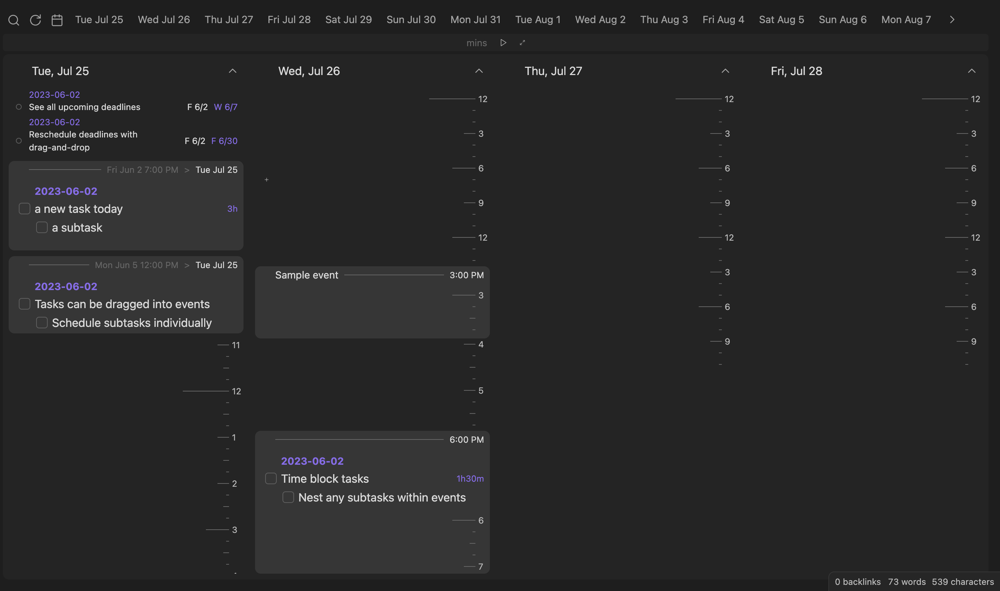
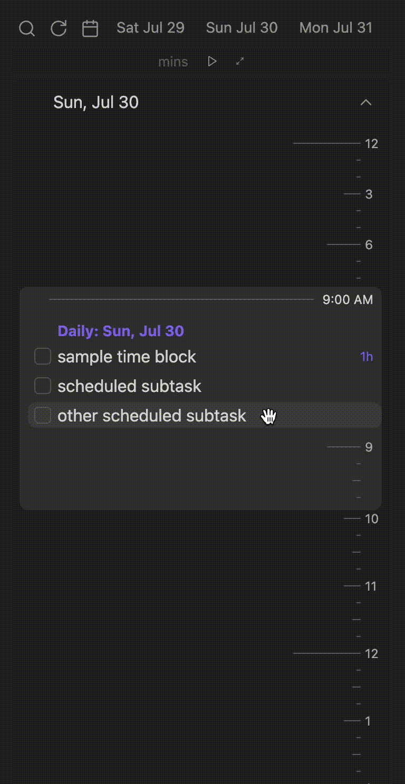

Time Ruler combines the best parts of a nested tasklist and an event-based calendar view. Drag-and-drop tasks to time-block and reschedule, and view tasks on top of read-only online calendars. Integrates well with the Tasks, FullCalendar, Reminder, and Obsidian Day Planner plugins.

# Features

- **Reads and writes tasks** in a variety of formats (Dataview inline fields, Tasks plugin emojis, or Full Calendar task-events)
- **Time-blocks** with nested tasks
- **Search** and filter scheduled, unscheduled, and due tasks
- **Drag 'n drop** tasks to reschedule and change duration
- Show all **files and headings**, drag to create new tasks
- **Create** new tasks at specific times via drag-and-drop
- Read-only **online calendars** via sharing links
- Integrated **timer/stopwatch** for Pomodoro and time-tracking
- Play a **sound** when you check a task!

# Documentation

Time Ruler uses the [Dataview](obsidian://show-plugin?id=dataview) plugin to read tasks, so please install it before you use this plugin.

## Reading tasks

Task metadata can be specified in any of the following formats:

- **Day Planner**: `YYYY-MM-DD hh:mm - hh:mm task content > yyyy-mm-dd [query:: <query>] ?/!/!!/!!!`
  - Beginning date/times: scheduled & duration, `>`: due date.
  - In Daily Notes, you can omit the date from scheduled and Time Ruler will parse the date from the note title. Only 24-hour format times are understood.
  - You can omit minutes and only put `hh - hh` for times.
- **Dataview**: `[scheduled:: yyyy-mm-ddThh:mm]  [due:: yyyy-mm-dd]  [duration:: #h#m]  [priority:: lowest/low/medium/high/highest] [query:: <query>]`
  - `#h#m` examples: `1h`, `1h30m`, `1.5h`, etc. Any [Dataview duration](https://blacksmithgu.github.io/obsidian-dataview/annotation/types-of-metadata/#duration) will work.
- **Tasks**: `[startTime:: hh:mm]  [duration:: #h#m] [query:: <query>] ⏳ yyyy-mm-dd 📅 yyyy-mm-dd ⏬/🔽/🔼/⏫/🔺`
  - ⏳: scheduled, 📅: due. See the [Tasks docs](https://publish.obsidian.md/tasks/Getting+Started/Dates) for a full description.
  - Order matters: inline fields must go before tasks emojis or Tasks won't understand it.
- **Full Calendar**: `[date:: yyyy-mm-dd]  [startTime:: hh:mm]  [endTime:: hh:mm] or [allDay:: true] [due:: yyyy-mm-dd]  [priority:: lowest/low/medium/high/highest] [query:: <query>]`

### Queries

As of version 2.0, Time ruler includes **queries**, tasks whose children are taken from a Dataview search. Some example searches:

- `[query:: "Path/to/folder"]` (notice the double-quotes, which are used for Dataview folder sources. Use `#` to designate a heading afterwards)
- `[query:: "#heading"]` (headings begin with #, but are framed in double-quotes).
- `[query:: #tag]`
- `[query:: incoming([[link to note]]) WHERE scheduled and !due]`
- Time Ruler supports sources, as well as WHERE queries with task properties. Read the full reference [here](https://blacksmithgu.github.io/obsidian-dataview/).

### Pages (tasks from full notes)

Time Ruler now reads **Full Calendar note events** as well as any page with `completed: false` or `completed: null` and the following optional Properties:

- `scheduled: date`
- `due: date`
- `priority: highest/high/medium/low/lowest`
- `duration: #h#m` (a Dataview duration - see above)
- `start: date`

### Reminder

You can specify any of the [Obsidian Reminder](https://obsidian-reminder.cf/guide/set-reminders.html#reminder-format) formats as well.

When editing a task via drag-and-drop, tasks are converted back to the formatting detected in the task. If this is not possible, the user's preferred format (Day Planner, Dataview, Tasks, or Full Calendar) is used. This can be changed in Settings.

_Note:_ Double-spaces are used between brackets because without them, Obsidian thinks they are markdown links.

## Scheduling tasks

- To **reschedule** a task, drag-and-drop the task onto the target block or time. You can drag a task to one of the day buttons or a day's heading to reschedule to that day. Click on a task to jump to it in Obsidian.
- To **create** a new scheduled task, drag the `+` button (top left) onto a time. For unscheduled, simply click the `+` button.
- To **move** a task to a different file or heading, drag it to the blue `->` button (top left).
- To change the **duration** of a task, drag its duration onto a time.
- To change the **deadline** of a task, drag its deadline onto a time.
- To **unschedule** a task, drag the task to the `Unscheduled` button.
- You can also drag **groups, headings, and blocks** to reschedule all of the tasks contained in them.
- Dragging and holding over a **date button** will scroll to that date, allowing you to drop the task there.

## Online calendars

- To **import** a calendar, simply copy a shared link (iCal format) into Settings (Ensure that the Access Permission for your calendar is set to public!).
- **Events** show as blocks which can contain tasks scheduled at the same time. You can drag an event to reschedule the tasks contained, but the event is read-only.
- To **refresh** events, click the `Refresh` button (the circular arrow) in the toolbar.
- For Google Calendar Users - You can find your iCal link at - "Calendar Settings\\[Your Calendar]\\Integrate Calendar\\Public address in iCal format\\".

## Buttons

- **Search**: Jump to a specific task.
- **Unscheduled:** Drag a task here to unschedule it. Click to show unscheduled tasks (shortcut to Search view).
- **Dates:** Click to scroll to that date, drag a task on top to schedule it for that date.
- **Quick add:** To create a task, drag the `+` button onto a time. By default, you will create in today's Daily note, but you can pick a specific heading or file.
- Click the **menu** `...` button (top-left) to view settings.
- **Past / Future**: show dates going to past or future. Past shows only completed tasks, while future shows uncompleted.
- **Reload**: Reload Obsidian tasks and online calendars.
- **Hide / Show Times**: Toggle the display of tic marks on Time Ruler.
- **Hours / Days / Weeks view**: Toggle between daily and hourly views. In daily view, hours are hidden.

## Timer

- To start a **stopwatch**, click the play button without any time entered.
- To start a **timer**, enter an amount in minutes and press the play button or "Enter."
- You can **add or subtract** 5 minutes while the timer is playing by clicking the `+` and `-` buttons.
- Click the `focus` button (outwards arrows) to expand the timer and focus on current tasks.

## Customization Settings

- **Custom Filter**: This is passed to `dv.pages(<custom filter>)`. It only filters out certain pages, and can't filter specific tasks within those. Use Custom Statuses to filter out tasks. See this [link](https://blacksmithgu.github.io/obsidian-dataview/api/code-reference/#dvpagessource) for `dv.pages()` and this [link](https://blacksmithgu.github.io/obsidian-dataview/reference/sources/) for how to format query sources.
  

  **Note:** do not include `dv.pages()` in the entry box—only the query string passed to the function.

  - Include a folder and its children: `"folder"`
  - Exclude a folder and its children: `-"folder"`
  - Include two folders and exclude a third: `"folder" or "folder2" and -"folder3"`
  - Include tags: `#tag or #tag2 and -#tag3`
  - Include pages which link to a page: `[[page]]`
  - Include links from page: `outgoing([[page]])`

- **Filter Function**: Provides a filtering function that uses the data passed from dv.pages()['file']['tasks']
  
  - Filtering out empty tasks: `(tasks) => tasks.where(task => task.text != "")`
  - Filtering out empty tags: ` (tasks) => tasks.where(task => task.tags.length===0)`
- **Custom Status**: Either **include only** certain custom statuses, or **exclude all** specified custom statuses (characters between `[ ]` in tasks).
- To style Time Ruler, the following classes are added:
  - `task-list-item`, `task-list-item-checkbox`, `task-due`, `task-scheduled`, `data-task`, and `task-priority` coincide with [Tasks plugin](https://publish.obsidian.md/tasks/Advanced/Styling) styling, and additional `task-duration` and `task-reminder` classes are added to those parts of tasks, so you can style them with CSS snippets (unfortunately, you will need to add your own custom status styling, due to custom themes being formatted for the Obsidian markdown editor, and not Time Ruler).
  - `time-ruler-heading` and `time-ruler-block` classes let you style headings and blocks.
  - `time-ruler-container` is added to the plugin's container element.

# Credit

- Many thanks to the [Dataview](obsidian://show-plugin?id=dataview), [Tasks](obsidian://show-plugin?id=obsidian-tasks-plugin), and [Full Calendar](obsidian://show-plugin?id=obsidian-full-calendar) plugins for setting the standards and formatting for managing tasks across the Obsidian vault.
- The Dataview plugin's MetadataCache made Time Ruler possible, so a huge thanks for the automatic indexing and parsing of task metadata.

# Network Usage

Upon calendar refresh, the plugin makes a single GET request to any calendars you are subscribed to, which downloads their events in .ics format.

# Changelog

For more information on past and future updates, please consult the [roadmap and changelog](https://github.com/joshuatazrein/obsidian-time-ruler/blob/master/CHANGELOG.md).

If you appreciate this plugin, I would love your support for further development!

